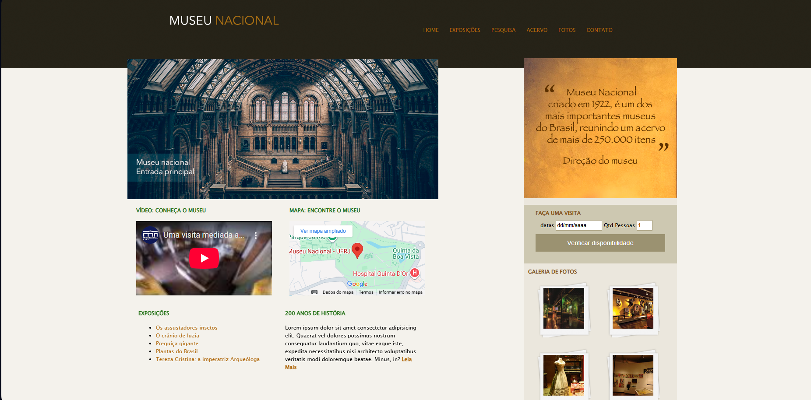

<h1 align="center" style="font-weight: bold;">Museu Nacional 💻</h1>

<p align="center">
 <a href="#tecnologias">Tecnologias</a> • 
 <a href="#começando">Como Começar</a> 
</p>

<p align="center">
    <b>Site Fictício de um Museu Brasileiro.</b>
</p>

<h2 id="tecnologias">💻 Tecnologias</h2>

- HTML
- CSS

<h2 id="começando">🚀 Como Começar</h2>

1️⃣ Clone o repositório:
```bash
git clone https://github.com/Dieegoo13/museu-nacional.git

```
<h2 id="tecnologias">📸 Preview do Projeto</h2>


